# Job Search Platform — SE 4458 Final Project (Group 2)

> A kariyer.net-style job search web application built with a cloud-native microservices architecture on Google Cloud.

---

## Quick Links

| Resource | URL                                                                                                       |
|---|-----------------------------------------------------------------------------------------------------------|
| **Live Application** | [Open App](https://job-search-frontend-248843403405.europe-west1.run.app/)                                |
| **API Gateway** | [Open Gateway](https://job-search-gateway-248843403405.europe-west1.run.app)                              |
| **Job Search Service (Swagger)** | [View Swagger](https://job-search-gateway-248843403405.europe-west1.run.app/job-search/swagger-ui.html)   |
| **Notification Service (Swagger)** | [View Swagger](https://job-search-gateway-248843403405.europe-west1.run.app/notification/swagger-ui.html) |
| **AI Service (Swagger)** | [View Swagger](https://job-search-gateway-248843403405.europe-west1.run.app/ai/swagger-ui.html)           |
| **Video** | [Watch on Google Drive](https://drive.google.com/file/d/1MDT4UQF48yRYT1EwWrqwWXQFsozij6ww/view?usp=sharing)                                                            |

## Note

> [!WARNING]
> Applications running on the Google Cloud free tier may scale down when there is no active traffic.  
> Because of this, the first request to real-time features such as AI Chat, Notifications, or other independent services may experience an initial delay ("cold start").  
> After the service becomes active, subsequent requests will respond normally with lower latency.

## Additional Repos

| Repository | URL |
|---|---|
| **Frontend** | [job-search-frontend](https://github.com/cansugunn/job-search-frontend) |
| **Job Search Service** | [job-search](https://github.com/cansugunn/job-search) |
| **Notification Service** | [job-search-notification](https://github.com/cansugunn/job-search-notification) |
| **AI Service** | [job-search-ai](https://github.com/cansugunn/job-search-ai) |
| **Gateway Service** | [job-search-gateway](https://github.com/cansugunn/job-search-gateway) |

---

## Runtime Evidence Screenshots

This project uses **Supabase Auth** as the IAM provider, **Redis** for cached job details and system tokens, **RabbitMQ** for new job addition events that are later drained by cron-based notification jobs, and **MongoDB** for job searches, job alerts, and notifications.

### Supabase Auth IAM

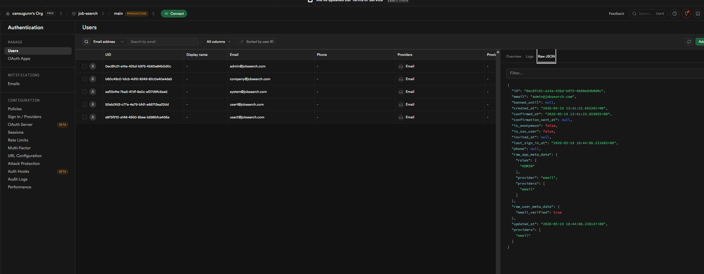

### Redis Job Detail Cache

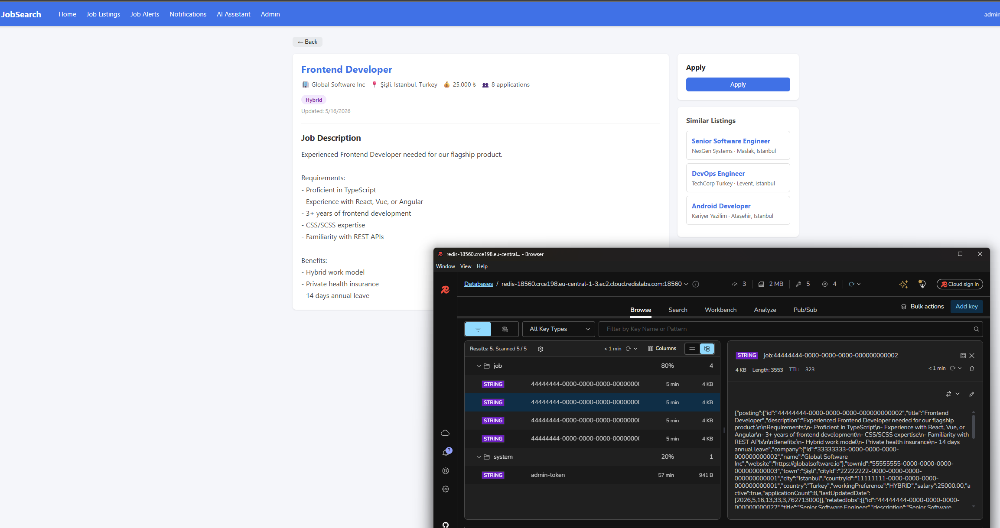

### RabbitMQ New Job Addition Queue

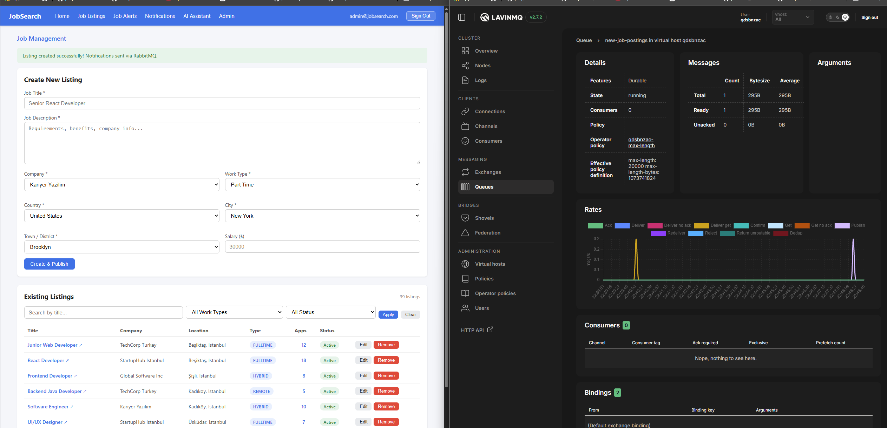

### Cron Job Alert And Search Match Notifications

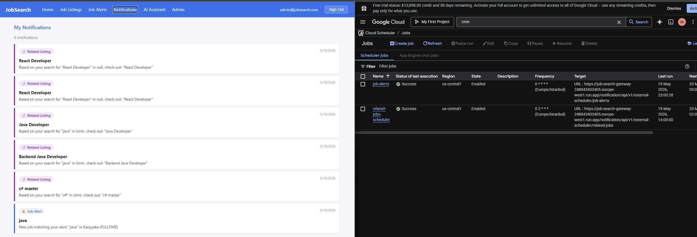

### MongoDB Job Searches

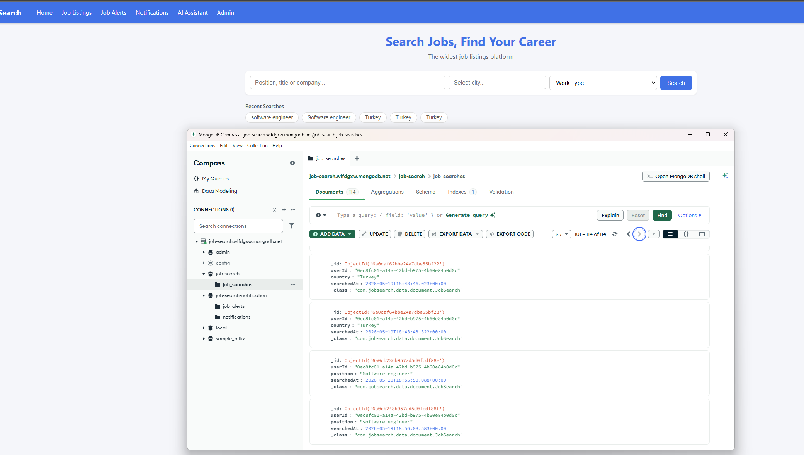

### MongoDB Job Alerts

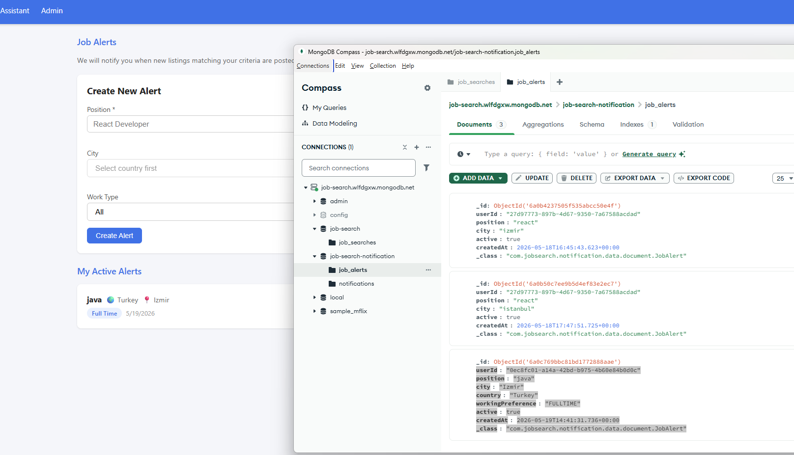

### MongoDB Notifications

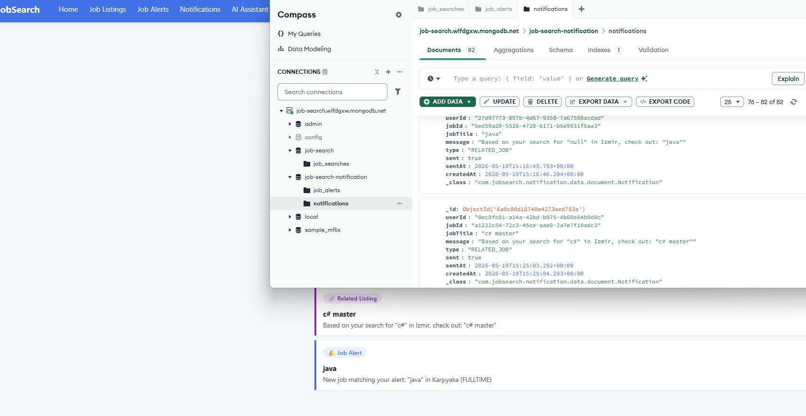

### AI Job Search Chat

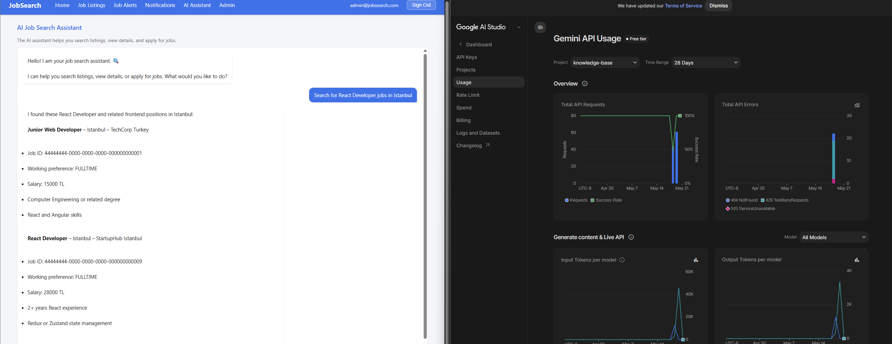

---

## Table of Contents

0. [Runtime Evidence Screenshots](#runtime-evidence-screenshots)
1. [Feature Checklist](#1-feature-checklist)
2. [High Level Design (HLD)](#2-high-level-design-hld)
3. [Microservices Overview](#3-microservices-overview)
4. [Low Level Design (LLD)](#4-low-level-design-lld)
5. [Data Models](#5-data-models)
6. [Sequence Diagrams](#6-sequence-diagrams)
7. [API Reference](#7-api-reference)
8. [Authentication](#8-authentication)
9. [Distributed Caching (Redis)](#9-distributed-caching-redis)
10. [System Token Service](#10-system-token-service)
11. [Message Queue (RabbitMQ)](#11-message-queue-rabbitmq)
12. [Scheduled Jobs (Google Cloud Scheduler)](#12-scheduled-jobs-google-cloud-scheduler)
13. [Deployment](#13-deployment)
14. [Design Assumptions](#14-design-assumptions)
15. [Issues Encountered & Solutions](#15-issues-encountered--solutions)
16. [Local Development](#16-local-development)

---

## 1. Feature Checklist

### Admin Service
- [x] Authenticated admins and companies can **create** job postings (`POST /api/v1/admin/jobs`)
- [x] Authenticated admins and companies can **update** job postings (`PUT /api/v1/admin/jobs/{id}`)
- [x] Role-based access control (`ADMIN` and `COMPANY` roles via Supabase JWT claims)
- [x] Admin UI page for creating/editing postings with cascading Country → City → Town dropdowns

### Home Page
- [x] **Search by position and city** — both inputs support autocomplete
- [x] City search detects **current city from browser geolocation** (via Nominatim reverse geocoding)
- [x] Shows **at least 5 local job postings** on the home page; falls back to general postings when none available
- [x] **Recent Searches** visible for logged-in users

### Search Results
- [x] **Filter pane** on the left: country → city → town (cascading dropdowns), working preference
- [x] **Active filter chips** displayed at top, each with an ✕ button to remove individually
- [x] Paginated results (10 per page with prev/next and page number buttons)

### Job Posting Detail
- [x] Job description, location (town / city / country), last updated date, application count
- [x] **At least 3 related postings** (same city + title keyword)
- [x] **Apply button** — redirects to login if not authenticated

### Notification Service
- [x] Users can **create job posting alerts** with filters (position, town, city, working preference)
- [x] **Job alert scheduled task** — drains RabbitMQ queue and creates notifications for matching users
- [x] **Related job scheduled task** — reads user search history from MongoDB, creates related-job notifications
- [x] Notifications surfaced in-app via `/notifications` page

### AI Agent Service
- [x] Chat window on main screen (`/chat`)
- [x] AI can **search jobs** on behalf of the user
- [x] AI can **get job detail**
- [x] AI can **apply to a job** 
- [x] Inline "Apply" action cards rendered after AI response

### Non-Functional Requirements
- [x] All REST services **versioned** (`/api/v1/...`)
- [x] All list endpoints **support pagination** (`Page<T>`, `Pageable`)
- [x] Deployed to **Google Cloud Run** (separate services)
- [x] All APIs routed through **API Gateway** (Spring Cloud Gateway)
- [x] **RabbitMQ** queue for new job posting events
- [x] **Supabase Auth** as the IAM service (JWT/ES256)
- [x] **Redis** distributed cache for job detail responses
- [x] Job searches stored in a **separate NoSQL DB** (MongoDB)
- [x] **Dockerfile** in every service
- [x] **PostgreSQL** on Cloud SQL (no SQLite)
- [x] Scheduling via **Google Cloud Scheduler**

---

## 2. High Level Design (HLD)

### System Architecture

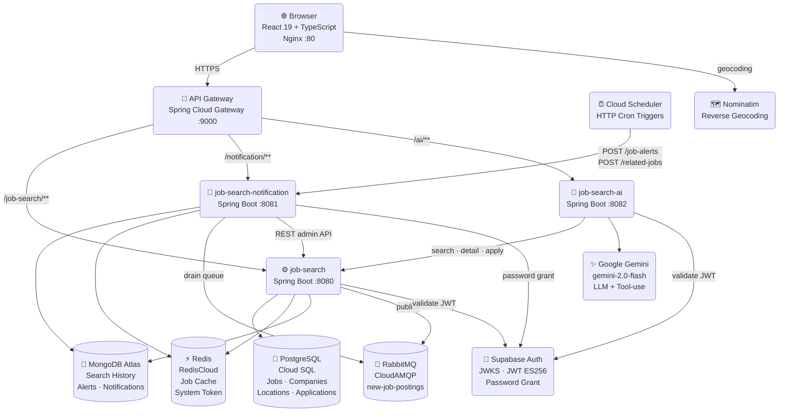
```mermaid
graph TD
    Browser("🌐 Browser\nReact 19 + TypeScript\nNginx :80")
    GW("🔀 API Gateway\nSpring Cloud Gateway :9000")
    JS("⚙️ job-search\nSpring Boot :8080")
    NT("🔔 job-search-notification\nSpring Boot :8081")
    AI("🤖 job-search-ai\nSpring Boot :8082")

    PG[("🐘 PostgreSQL\nCloud SQL\nJobs · Companies\nLocations · Applications")]
    MG[("🍃 MongoDB Atlas\nSearch History\nAlerts · Notifications")]
    RD[("⚡ Redis\nRedisCloud\nJob Cache\nSystem Token")]
    RQ[("📨 RabbitMQ\nCloudAMQP\nnew-job-postings")]
    SB("🔐 Supabase Auth\nJWKS · JWT ES256\nPassword Grant")
    GM("✨ Google Gemini\ngemini-2.0-flash\nLLM + Tool-use")
    CS("⏰ Cloud Scheduler\nHTTP Cron Triggers")
    NM("🗺️ Nominatim\nReverse Geocoding")

    Browser -->|HTTPS| GW
    GW -->|"/job-search/**"| JS
    GW -->|"/notification/**"| NT
    GW -->|"/ai/**"| AI

    JS --> PG
    JS --> RD
    JS --> MG
    JS -->|publish| RQ
    JS -->|validate JWT| SB

    NT --> MG
    NT --> RD
    NT -->|drain queue| RQ
    NT -->|REST admin API| JS
    NT -->|password grant| SB

    AI -->|search · detail · apply| JS
    AI --> GM
    AI -->|validate JWT| SB

    CS -->|"POST /job-alerts\nPOST /related-jobs"| NT
    Browser -->|geocoding| NM
```

### External Dependencies

| Dependency | Provider | Purpose |
|---|---|---|
| **PostgreSQL** | Google Cloud SQL | Relational data — jobs, companies, locations, applications |
| **MongoDB** | MongoDB Atlas | Search history, alerts, notifications (NoSQL) |
| **Redis** | RedisCloud | Job detail cache + system token cache + distributed lock |
| **RabbitMQ** | CloudAMQP | New-job-posting event queue (drain-on-demand) |
| **Supabase Auth** | Supabase | Identity management, JWT issuance, JWKS, password grant |
| **Gemini** | Google AI | LLM backend for the AI job assistant |
| **Cloud Scheduler** | GCP | HTTP cron triggers for notification processing tasks |
| **Nominatim** | OpenStreetMap | Reverse geocoding for auto-detect city on home page |

---

## 3. Microservices Overview

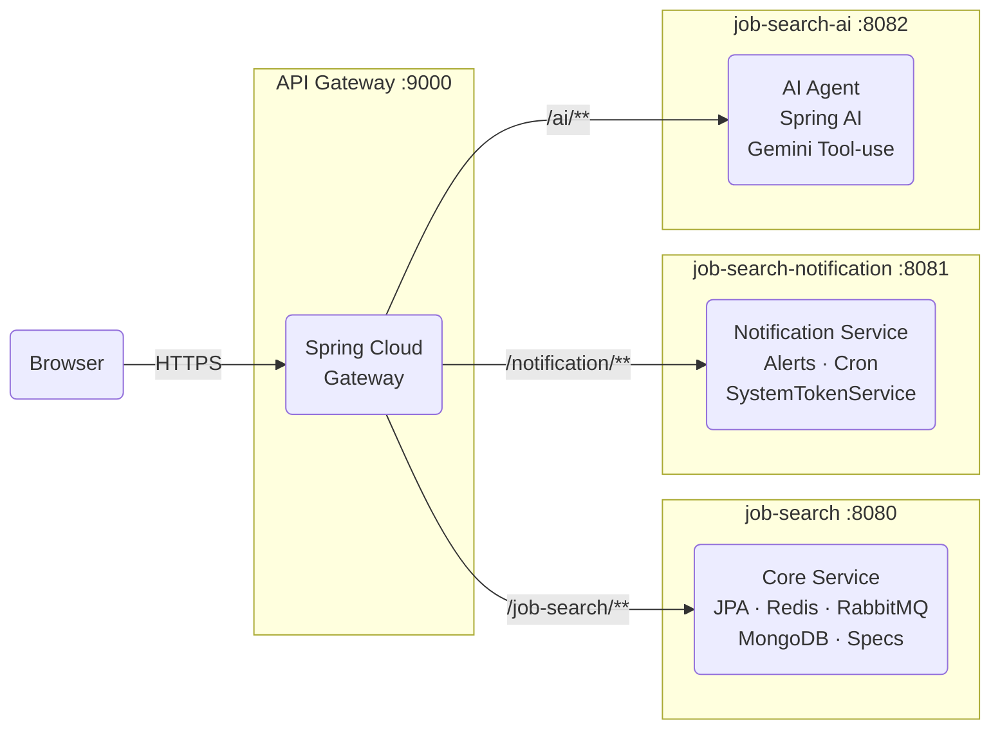
```mermaid
graph LR
    Browser("Browser") -->|HTTPS| GW

    subgraph "API Gateway :9000"
        GW("Spring Cloud\nGateway")
    end

    GW -->|"/job-search/**"| S1
    GW -->|"/notification/**"| S2
    GW -->|"/ai/**"| S3

    subgraph "job-search :8080"
        S1("Core Service\nJPA · Redis · RabbitMQ\nMongoDB · Specs")
    end

    subgraph "job-search-notification :8081"
        S2("Notification Service\nAlerts · Cron\nSystemTokenService")
    end

    subgraph "job-search-ai :8082"
        S3("AI Agent\nSpring AI\nGemini Tool-use")
    end
```

| Service | Stack | Port | Context Path | Responsibilities |
|---|---|---|---|---|
| **job-search-frontend** | React 19, TypeScript, Vite, Nginx | 80 | `/` | Home, Search, Detail, Admin, Alerts, Notifications, AI Chat |
| **job-search-gateway** | Spring Cloud Gateway WebFlux | 9000 | — | Route `/job-search/**`, `/notification/**`, `/ai/**` |
| **job-search** | Spring Boot 3.4, JPA, MongoDB, Redis, RabbitMQ | 8080 | `/job-search` | Job CRUD, search, apply, search history, locations |
| **job-search-notification** | Spring Boot 3.4, MongoDB, Redis, RabbitMQ | 8081 | `/notification` | Alerts, notifications, cron handlers, system token |
| **job-search-ai** | Spring Boot 3.4, Spring AI 1.1.6, Gemini | 8082 | `/ai` | AI chat agent with tool-use for search/detail/apply |

---

## 4. Low Level Design (LLD)

### 4.1 job-search service

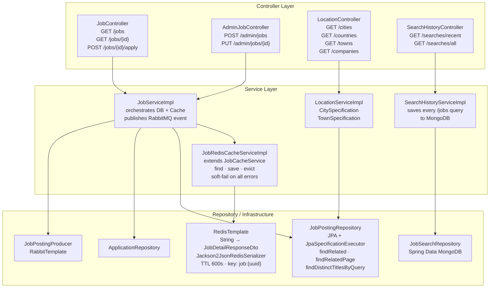
```mermaid
graph TD
    subgraph "Controller Layer"
        JC["JobController\nGET /jobs\nGET /jobs/{id}\nPOST /jobs/{id}/apply"]
        AJC["AdminJobController\nPOST /admin/jobs\nPUT /admin/jobs/{id}"]
        LC["LocationController\nGET /cities\nGET /countries\nGET /towns\nGET /companies"]
        SC["SearchHistoryController\nGET /searches/recent\nGET /searches/all"]
    end

    subgraph "Service Layer"
        JSvc["JobServiceImpl\norchestrates DB + Cache\npublishes RabbitMQ event"]
        Cache["JobRedisCacheServiceImpl\nextends JobCacheService\nfind · save · evict\nsoft-fail on all errors"]
        LSvc["LocationServiceImpl\nCitySpecification\nTownSpecification"]
        SSH["SearchHistoryServiceImpl\nsaves every /jobs query\nto MongoDB"]
    end

    subgraph "Repository / Infrastructure"
        JPR["JobPostingRepository\nJPA + JpaSpecificationExecutor\nfindRelated · findRelatedPage\nfindDistinctTitlesByQuery"]
        AR["ApplicationRepository"]
        JMR["JobSearchRepository\nSpring Data MongoDB"]
        RT["RedisTemplate\nString → JobDetailResponseDto\nJackson2JsonRedisSerializer\nTTL 600s · key: job:{uuid}"]
        MQ["JobPostingProducer\nRabbitTemplate"]
    end

    JC --> JSvc
    AJC --> JSvc
    LC --> LSvc
    SC --> SSH
    JSvc --> Cache
    JSvc --> JPR
    JSvc --> AR
    JSvc --> MQ
    Cache --> RT
    SSH --> JMR
    LSvc --> JPR
```

**Key design decisions:**
- `JobRedisCacheServiceImpl.find()` and `save()` both catch all exceptions, log a `WARN`, and treat failure as a cache miss — cache errors never fail a user request.
- `JobPostingSpecification` uses JPA metamodel string constants (`JobPosting_.TOWN`, `Town_.CITY`, etc.) for type-safe criteria queries without raw string paths.
- The location hierarchy is **Country → City → Town → JobPosting** — a posting stores only `town_id`; city and country are derived through JPA joins.

---

### 4.2 job-search-notification service

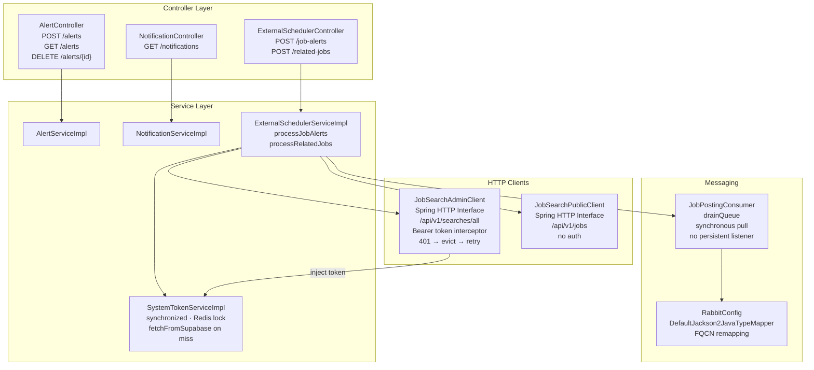
```mermaid
graph TD
    subgraph "Controller Layer"
        AC["AlertController\nPOST /alerts\nGET /alerts\nDELETE /alerts/{id}"]
        NC["NotificationController\nGET /notifications"]
        EC["ExternalSchedulerController\nPOST /job-alerts\nPOST /related-jobs"]
    end

    subgraph "Service Layer"
        ASvc["AlertServiceImpl"]
        NSvc["NotificationServiceImpl"]
        ESvc["ExternalSchedulerServiceImpl\nprocessJobAlerts\nprocessRelatedJobs"]
        STS["SystemTokenServiceImpl\nsynchronized · Redis lock\nfetchFromSupabase on miss"]
    end

    subgraph "HTTP Clients"
        ADC["JobSearchAdminClient\nSpring HTTP Interface\n/api/v1/searches/all\nBearer token interceptor\n401 → evict → retry"]
        PBC["JobSearchPublicClient\nSpring HTTP Interface\n/api/v1/jobs\nno auth"]
    end

    subgraph "Messaging"
        JPC["JobPostingConsumer\ndrainQueue\nsynchronous pull\nno persistent listener"]
        RC["RabbitConfig\nDefaultJackson2JavaTypeMapper\nFQCN remapping"]
    end

    AC --> ASvc
    NC --> NSvc
    EC --> ESvc
    ESvc --> STS
    ESvc --> ADC
    ESvc --> PBC
    ESvc --> JPC
    JPC --> RC
    ADC -->|"inject token"| STS
```

**Drain-on-demand:** The service registers no persistent AMQP listener. `drainQueue()` is called once per cron tick. This is compatible with Cloud Run scale-to-zero — no idle container required.

**Paginated fetch:** `fetchAllSearchPages()` and `fetchAllPages()` loop in batches of 50 until `PageResponse.last() == true` — no `Integer.MAX_VALUE` hacks.

---

### 4.3 job-search-ai service

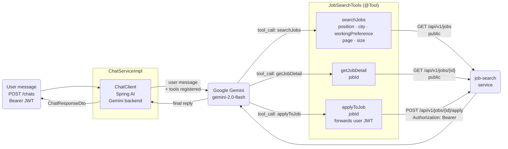
```mermaid
flowchart LR
    User("User message\nPOST /chats\nBearer JWT") --> CS

    subgraph "ChatServiceImpl"
        CS["ChatClient\nSpring AI\nGemini backend"]
    end

    CS -->|"user message\n+ tools registered"| Gemini("Google Gemini\ngemini-2.0-flash")

    Gemini -->|"tool_call: searchJobs"| T1
    Gemini -->|"tool_call: getJobDetail"| T2
    Gemini -->|"tool_call: applyToJob"| T3

    subgraph "JobSearchTools (@Tool)"
        T1["searchJobs\nposition · city · workingPreference\npage · size"]
        T2["getJobDetail\njobId"]
        T3["applyToJob\njobId\nforwards user JWT"]
    end

    T1 -->|"GET /api/v1/jobs\npublic"| API("job-search\nservice")
    T2 -->|"GET /api/v1/jobs/{id}\npublic"| API
    T3 -->|"POST /api/v1/jobs/{id}/apply\nAuthorization: Bearer"| API

    API --> Gemini
    Gemini -->|final reply| CS
    CS -->|ChatResponseDto| User
```

The user's JWT is extracted from the `/chats` request and held in `RequestScope` — `applyToJob` forwards it as the `Authorization` header so apply actions are authenticated as the actual user, not the service.

---

### 4.4 job-search-gateway

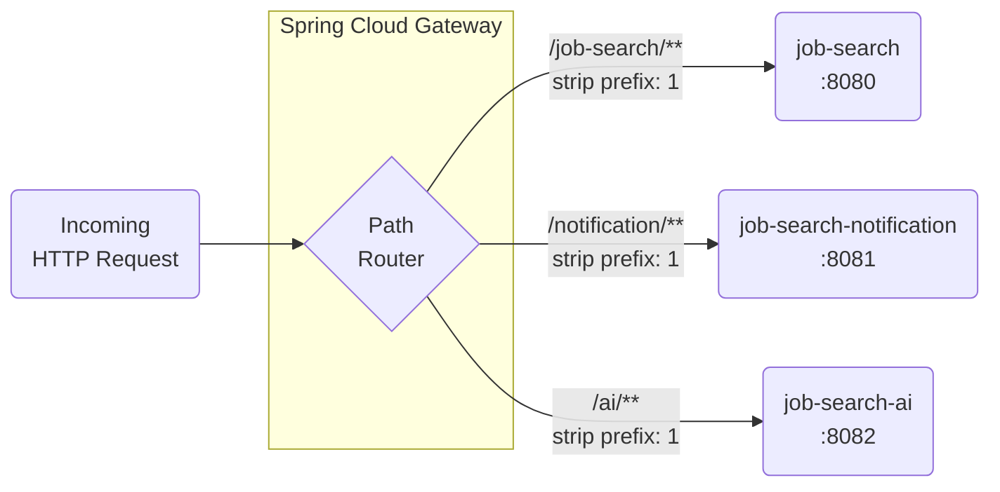
```mermaid
graph LR
    In("Incoming\nHTTP Request") --> GW

    subgraph "Spring Cloud Gateway"
        GW{"Path\nRouter"}
    end

    GW -->|"/job-search/**\nstrip prefix: 1"| JS("job-search\n:8080")
    GW -->|"/notification/**\nstrip prefix: 1"| NT("job-search-notification\n:8081")
    GW -->|"/ai/**\nstrip prefix: 1"| AI("job-search-ai\n:8082")
```

No business logic — pure routing and CORS. Each downstream service owns its own `SecurityConfig` and `CorsConfigurationSource` bean.

---

## 5. Data Models

### PostgreSQL Schema

Location hierarchy: `countries` → `cities` → `towns` → `job_postings`

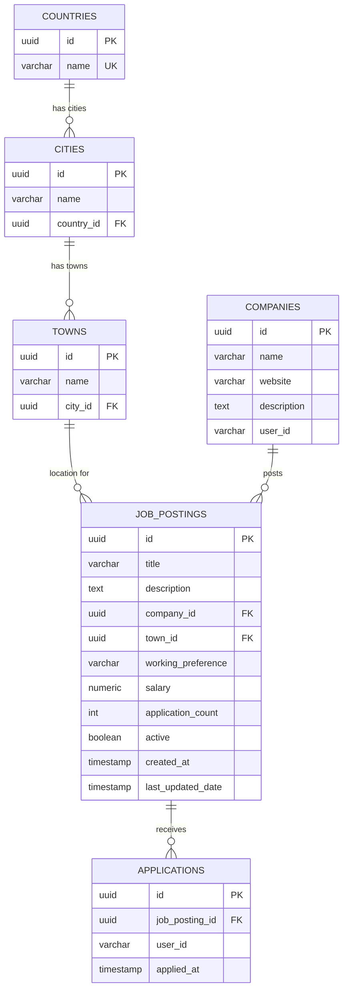
```mermaid
erDiagram
    COUNTRIES {
        uuid    id   PK
        varchar name UK
    }
    CITIES {
        uuid    id         PK
        varchar name
        uuid    country_id FK
    }
    TOWNS {
        uuid    id      PK
        varchar name
        uuid    city_id FK
    }
    COMPANIES {
        uuid    id          PK
        varchar name
        varchar website
        text    description
        varchar user_id
    }
    JOB_POSTINGS {
        uuid      id                 PK
        varchar   title
        text      description
        uuid      company_id         FK
        uuid      town_id            FK
        varchar   working_preference
        numeric   salary
        int       application_count
        boolean   active
        timestamp created_at
        timestamp last_updated_date
    }
    APPLICATIONS {
        uuid      id             PK
        uuid      job_posting_id FK
        varchar   user_id
        timestamp applied_at
    }

    COUNTRIES  ||--o{ CITIES       : "has cities"
    CITIES     ||--o{ TOWNS        : "has towns"
    TOWNS      ||--o{ JOB_POSTINGS : "location for"
    COMPANIES  ||--o{ JOB_POSTINGS : "posts"
    JOB_POSTINGS ||--o{ APPLICATIONS : "receives"
```

`working_preference` CHECK: `FULLTIME | PARTTIME | REMOTE | HYBRID`

**DDL (abbreviated)**

```sql
CREATE TABLE countries (
    id   UUID PRIMARY KEY DEFAULT gen_random_uuid(),
    name VARCHAR(100) NOT NULL UNIQUE
);

CREATE TABLE cities (
    id         UUID PRIMARY KEY DEFAULT gen_random_uuid(),
    name       VARCHAR(100) NOT NULL,
    country_id UUID NOT NULL REFERENCES countries(id)
);

CREATE TABLE towns (
    id      UUID PRIMARY KEY DEFAULT gen_random_uuid(),
    name    VARCHAR(100) NOT NULL,
    city_id UUID NOT NULL REFERENCES cities(id)
);

CREATE TABLE companies (
    id          UUID PRIMARY KEY DEFAULT gen_random_uuid(),
    name        VARCHAR(200) NOT NULL,
    website     VARCHAR(255),
    description TEXT,
    user_id     VARCHAR(255)
);

CREATE TABLE job_postings (
    id                 UUID PRIMARY KEY DEFAULT gen_random_uuid(),
    title              VARCHAR(255) NOT NULL,
    description        TEXT,
    company_id         UUID NOT NULL REFERENCES companies(id),
    town_id            UUID NOT NULL REFERENCES towns(id),
    working_preference VARCHAR(20) NOT NULL
        CHECK (working_preference IN ('FULLTIME','PARTTIME','REMOTE','HYBRID')),
    salary             NUMERIC(12,2),
    application_count  INTEGER NOT NULL DEFAULT 0,
    active             BOOLEAN NOT NULL DEFAULT TRUE,
    created_at         TIMESTAMP NOT NULL DEFAULT NOW(),
    last_updated_date  TIMESTAMP NOT NULL DEFAULT NOW()
);

CREATE TABLE applications (
    id             UUID PRIMARY KEY DEFAULT gen_random_uuid(),
    job_posting_id UUID NOT NULL REFERENCES job_postings(id),
    user_id        VARCHAR(255) NOT NULL,
    applied_at     TIMESTAMP NOT NULL DEFAULT NOW(),
    UNIQUE (job_posting_id, user_id)
);
```

---

### MongoDB Documents

Two Atlas clusters — one per service — for strict service isolation.

#### `job-search` — collection: `job_searches`

```json
{
  "_id": "ObjectId",
  "userId": "supabase-user-uuid",
  "position": "React Developer",
  "town": "55555555-0000-0000-0000-000000000001",
  "city": "Istanbul",
  "country": null,
  "workingPreference": "REMOTE",
  "searchedAt": "2026-05-18T10:30:00"
}
```

Indexes: `userId`, `searchedAt` (range: `searchedAt >= now − 7 days`).

#### `job-search-notification` — collection: `job_alerts`

```json
{
  "_id": "ObjectId",
  "userId": "supabase-user-uuid",
  "position": "Backend Developer",
  "town": "Kadıköy",
  "city": "Istanbul",
  "country": null,
  "workingPreference": "FULLTIME",
  "active": true,
  "createdAt": "2026-05-10T08:00:00"
}
```

#### `job-search-notification` — collection: `notifications`

```json
{
  "_id": "ObjectId",
  "userId": "supabase-user-uuid",
  "jobId": "44444444-0000-0000-0000-000000000003",
  "jobTitle": "Backend Java Developer",
  "message": "New job matching your alert: \"Backend Java Developer\" in Kadıköy (REMOTE)",
  "type": "JOB_ALERT",
  "sent": true,
  "sentAt": "2026-05-18T00:01:05",
  "createdAt": "2026-05-18T00:01:05"
}
```

`type` enum: `JOB_ALERT | RELATED_JOB`. Index: `userId`; compound `(userId, jobId)` for dedup.

---

## 6. Sequence Diagrams

### Job Search & Save History

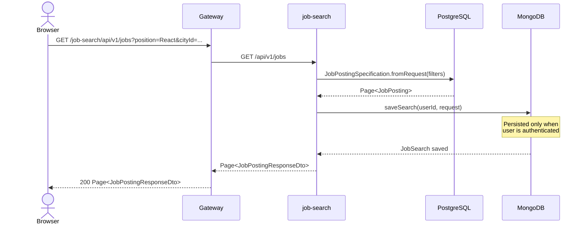
```mermaid
sequenceDiagram
    actor Browser
    participant GW as Gateway
    participant JS as job-search
    participant PG as PostgreSQL
    participant MG as MongoDB

    Browser->>GW: GET /job-search/api/v1/jobs?position=React&cityId=...
    GW->>JS: GET /api/v1/jobs
    JS->>PG: JobPostingSpecification.fromRequest(filters)
    PG-->>JS: Page<JobPosting>
    JS->>MG: saveSearch(userId, request)
    Note over MG: Persisted only when<br/>user is authenticated
    MG-->>JS: JobSearch saved
    JS-->>GW: Page<JobPostingResponseDto>
    GW-->>Browser: 200 Page<JobPostingResponseDto>
```

---

### Apply to a Job Posting

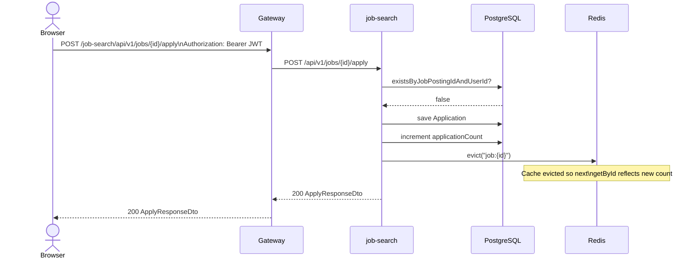
```mermaid
sequenceDiagram
    actor Browser
    participant GW as Gateway
    participant JS as job-search
    participant PG as PostgreSQL
    participant RD as Redis

    Browser->>GW: POST /job-search/api/v1/jobs/{id}/apply\nAuthorization: Bearer JWT
    GW->>JS: POST /api/v1/jobs/{id}/apply
    JS->>PG: existsByJobPostingIdAndUserId?
    PG-->>JS: false
    JS->>PG: save Application
    JS->>PG: increment applicationCount
    JS->>RD: evict("job:{id}")
    Note over RD: Cache evicted so next\ngetById reflects new count
    JS-->>GW: 200 ApplyResponseDto
    GW-->>Browser: 200 ApplyResponseDto
```

---

### Job Alert Cron

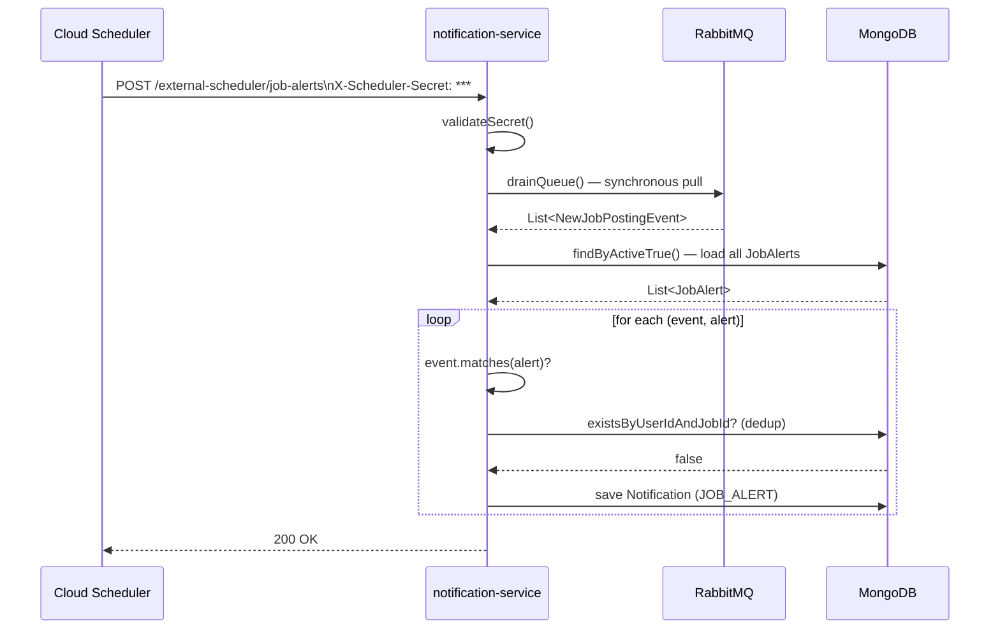
```mermaid
sequenceDiagram
    participant CS as Cloud Scheduler
    participant NT as notification-service
    participant RQ as RabbitMQ
    participant MG as MongoDB

    CS->>NT: POST /external-scheduler/job-alerts\nX-Scheduler-Secret: ***
    NT->>NT: validateSecret()
    NT->>RQ: drainQueue() — synchronous pull
    RQ-->>NT: List<NewJobPostingEvent>
    NT->>MG: findByActiveTrue() — load all JobAlerts
    MG-->>NT: List<JobAlert>

    loop for each (event, alert)
        NT->>NT: event.matches(alert)?
        NT->>MG: existsByUserIdAndJobId? (dedup)
        MG-->>NT: false
        NT->>MG: save Notification (JOB_ALERT)
    end

    NT-->>CS: 200 OK
```

---

### Related Jobs Cron

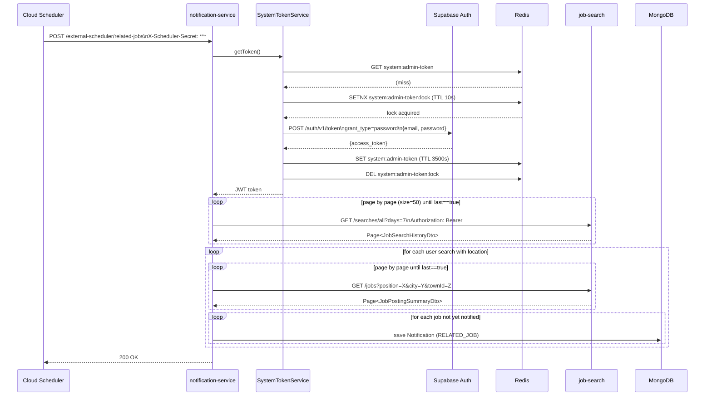
```mermaid
sequenceDiagram
    participant CS as Cloud Scheduler
    participant NT as notification-service
    participant STS as SystemTokenService
    participant SB as Supabase Auth
    participant RD as Redis
    participant JS as job-search
    participant MG as MongoDB

    CS->>NT: POST /external-scheduler/related-jobs\nX-Scheduler-Secret: ***
    NT->>STS: getToken()
    STS->>RD: GET system:admin-token
    RD-->>STS: (miss)
    STS->>RD: SETNX system:admin-token:lock (TTL 10s)
    RD-->>STS: lock acquired
    STS->>SB: POST /auth/v1/token\ngrant_type=password\n{email, password}
    SB-->>STS: {access_token}
    STS->>RD: SET system:admin-token (TTL 3500s)
    STS->>RD: DEL system:admin-token:lock
    STS-->>NT: JWT token

    loop page by page (size=50) until last==true
        NT->>JS: GET /searches/all?days=7\nAuthorization: Bearer
        JS-->>NT: Page<JobSearchHistoryDto>
    end

    loop for each user search with location
        loop page by page until last==true
            NT->>JS: GET /jobs?position=X&city=Y&townId=Z
            JS-->>NT: Page<JobPostingSummaryDto>
        end
        loop for each job not yet notified
            NT->>MG: save Notification (RELATED_JOB)
        end
    end

    NT-->>CS: 200 OK
```

---

### AI Agent Chat

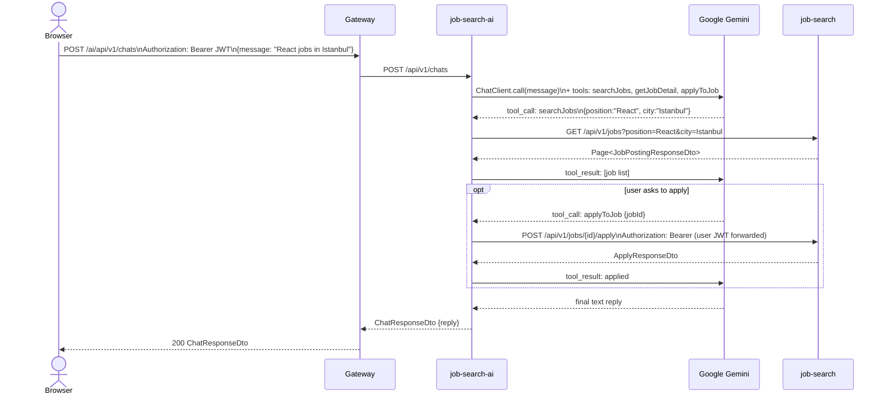
```mermaid
sequenceDiagram
    actor Browser
    participant GW as Gateway
    participant AI as job-search-ai
    participant GM as Google Gemini
    participant JS as job-search

    Browser->>GW: POST /ai/api/v1/chats\nAuthorization: Bearer JWT\n{message: "React jobs in Istanbul"}
    GW->>AI: POST /api/v1/chats

    AI->>GM: ChatClient.call(message)\n+ tools: searchJobs, getJobDetail, applyToJob
    GM-->>AI: tool_call: searchJobs\n{position:"React", city:"Istanbul"}
    AI->>JS: GET /api/v1/jobs?position=React&city=Istanbul
    JS-->>AI: Page<JobPostingResponseDto>
    AI->>GM: tool_result: [job list]

    opt user asks to apply
        GM-->>AI: tool_call: applyToJob {jobId}
        AI->>JS: POST /api/v1/jobs/{id}/apply\nAuthorization: Bearer (user JWT forwarded)
        JS-->>AI: ApplyResponseDto
        AI->>GM: tool_result: applied
    end

    GM-->>AI: final text reply
    AI-->>GW: ChatResponseDto {reply}
    GW-->>Browser: 200 ChatResponseDto
```

---

## 7. API Reference

All services are versioned at `/api/v1/`. All list endpoints return `Page<T>` and accept `Pageable` (`page`, `size`, `sort`).

### Job Search Service (`/job-search/api/v1`)

| Method | Path | Auth | Description |
|---|---|---|---|
| `GET` | `/jobs` | Optional | Search postings — `position`, `city`, `countryId`, `cityId`, `townId`, `workingPreference` |
| `GET` | `/jobs/{id}` | — | Job detail + 3 related jobs (Redis-cached) |
| `GET` | `/jobs/{id}/related` | — | Paginated related jobs |
| `GET` | `/jobs/{id}/applied` | Required | Whether current user has applied |
| `POST` | `/jobs/{id}/apply` | Required | Apply to a posting |
| `GET` | `/jobs/autocomplete` | — | Position title autocomplete |
| `GET` | `/jobs/by-city` | — | Jobs filtered by city name (home page city cards) |
| `POST` | `/admin/jobs` | ADMIN / COMPANY | Create job posting |
| `PUT` | `/admin/jobs/{id}` | ADMIN / COMPANY | Update job posting |
| `GET` | `/countries` | — | All countries |
| `GET` | `/cities` | — | Cities, filter by `query` + `countryId` |
| `GET` | `/towns` | — | Towns, filter by `query` + `cityId` |
| `GET` | `/companies` | — | All companies |
| `GET` | `/searches/recent` | Required | Last N searches of the current user |
| `GET` | `/searches/all` | ADMIN | All user searches, last N days, paginated (used by notification cron) |

### Notification Service (`/notification/api/v1`)

| Method | Path | Auth | Description |
|---|---|---|---|
| `POST` | `/alerts` | Required | Create a job alert |
| `GET` | `/alerts` | Required | List my active alerts |
| `DELETE` | `/alerts/{id}` | Required | Delete an alert |
| `GET` | `/notifications` | Required | My notification feed |
| `POST` | `/external-scheduler/job-alerts` | Scheduler secret | Process new-posting alerts (cron) |
| `POST` | `/external-scheduler/related-jobs` | Scheduler secret | Process related-job notifications (cron) |

### AI Service (`/ai/api/v1`)

| Method | Path | Auth | Description |
|---|---|---|---|
| `POST` | `/chats` | Required | Send a message to the AI job assistant |

---

## 8. Authentication

**Supabase Auth** is the IAM service. All three backend services are configured as **OAuth2 Resource Servers** and validate JWTs with Supabase's JWKS endpoint.

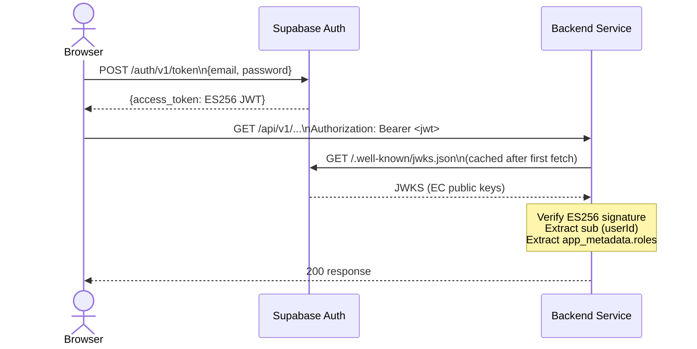
```mermaid
sequenceDiagram
    actor Browser
    participant SB as Supabase Auth
    participant SVC as Backend Service

    Browser->>SB: POST /auth/v1/token\n{email, password}
    SB-->>Browser: {access_token: ES256 JWT}

    Browser->>SVC: GET /api/v1/...\nAuthorization: Bearer <jwt>
    SVC->>SB: GET /.well-known/jwks.json\n(cached after first fetch)
    SB-->>SVC: JWKS (EC public keys)
    Note over SVC: Verify ES256 signature<br/>Extract sub (userId)<br/>Extract app_metadata.roles
    SVC-->>Browser: 200 response
```

**JWT Configuration** (all backend services):

```properties
spring.security.oauth2.resourceserver.jwt.jwk-set-uri=${SUPABASE_JWKS_URI}
spring.security.oauth2.resourceserver.jwt.jws-algorithms=ES256
```

Roles (`ADMIN`, `COMPANY`) are stored in `app_metadata.roles` in the Supabase JWT and extracted by `SupabaseJwtConverter` into Spring `GrantedAuthority` objects.

**CORS:** Each service's `SecurityConfig` provides a `CorsConfigurationSource` bean allowing all origins, methods, and headers — required for Swagger UI cross-origin calls.

---

## 9. Distributed Caching (Redis)

Job posting detail responses (JPA joins + related-jobs subquery) are cached in Redis to reduce load and improve latency.

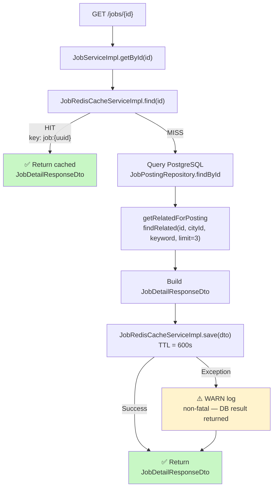
```mermaid
flowchart TD
    A["GET /jobs/{id}"] --> B["JobServiceImpl.getById(id)"]
    B --> C["JobRedisCacheServiceImpl.find(id)"]

    C -->|"HIT\nkey: job:{uuid}"| D["✅ Return cached\nJobDetailResponseDto"]

    C -->|"MISS"| E["Query PostgreSQL\nJobPostingRepository.findById"]
    E --> F["getRelatedForPosting\nfindRelated(id, cityId, keyword, limit=3)"]
    F --> G["Build JobDetailResponseDto"]

    G --> H["JobRedisCacheServiceImpl.save(dto)\nTTL = 600s"]
    H -->|"Exception"| I["⚠️ WARN log\nnon-fatal — DB result returned"]
    H -->|"Success"| J["✅ Return\nJobDetailResponseDto"]
    I --> J

    style D fill:#c8f7c5
    style J fill:#c8f7c5
    style I fill:#fff3cd
```

| Property | Value |
|---|---|
| **Key format** | `job:{uuid}` |
| **TTL** | 600 s (configurable via `job-search.cache.job-posting.ttl`) |
| **Serializer** | `Jackson2JsonRedisSerializer<JobDetailResponseDto>` |
| **Template type** | `RedisTemplate<String, JobDetailResponseDto>` |
| **Eviction triggers** | `PUT /admin/jobs/{id}` (update) and `POST /jobs/{id}/apply` (count change) |
| **Resilience** | Deserialization or connection failure → WARN log → cache miss → DB fallback (self-healing) |

**Why typed serializer?** `RedisTemplate<String, Object>` with `activateDefaultTyping` embeds a `@class` field. Manually seeded keys lack it, causing `Could not resolve subtype: missing type id property '@class'`. The typed `Jackson2JsonRedisSerializer<JobDetailResponseDto>` writes plain JSON and deserializes directly to the known type — no `@class` dependency.

---

## 10. System Token Service

The notification cron needs to call `GET /searches/all` (ADMIN-only). Rather than a static long-lived credential, `SystemTokenServiceImpl` acquires a short-lived JWT via Supabase password grant and caches it in Redis with a distributed lock to prevent thundering herd across Cloud Run replicas.

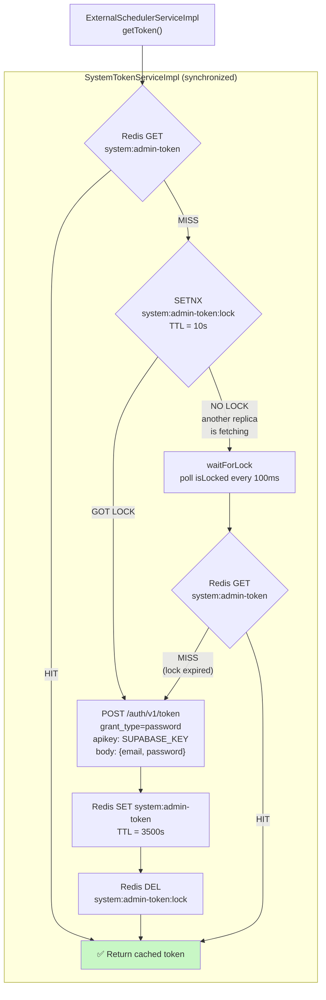
```mermaid
flowchart TD
    A["ExternalSchedulerServiceImpl\ngetToken()"] --> B

    subgraph "SystemTokenServiceImpl (synchronized)"
        B{"Redis GET\nsystem:admin-token"}
        B -->|HIT| C["✅ Return cached token"]
        B -->|MISS| D

        D{"SETNX\nsystem:admin-token:lock\nTTL = 10s"}

        D -->|"GOT LOCK"| E["POST /auth/v1/token\ngrant_type=password\napikey: SUPABASE_KEY\nbody: {email, password}"]
        E --> F["Redis SET system:admin-token\nTTL = 3500s"]
        F --> G["Redis DEL\nsystem:admin-token:lock"]
        G --> C

        D -->|"NO LOCK\nanother replica\nis fetching"| H["waitForLock\npoll isLocked every 100ms"]
        H --> I{"Redis GET\nsystem:admin-token"}
        I -->|HIT| C
        I -->|"MISS\n(lock expired)"| E
    end

    style C fill:#c8f7c5
```

### 401 Retry in HTTP Client

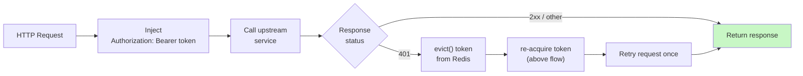
```mermaid
flowchart LR
    REQ["HTTP Request"] --> INJ["Inject\nAuthorization: Bearer token"]
    INJ --> CALL["Call upstream\nservice"]
    CALL --> CHK{Response\nstatus}
    CHK -->|"2xx / other"| RET["Return response"]
    CHK -->|"401"| EVICT["evict() token\nfrom Redis"]
    EVICT --> REACQ["re-acquire token\n(above flow)"]
    REACQ --> RETRY["Retry request once"]
    RETRY --> RET

    style RET fill:#c8f7c5
```

**Why two-level locking?** `synchronized` prevents races within a single JVM. Redis `SETNX` prevents redundant Supabase calls across multiple Cloud Run replicas. Token TTL 3500s (vs. Supabase's 3600s) ensures proactive refresh before expiry.

---

## 11. Message Queue (RabbitMQ)

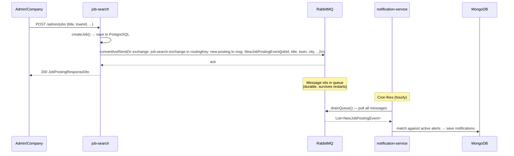
```mermaid
sequenceDiagram
    participant ADM as Admin/Company
    participant JS as job-search
    participant RQ as RabbitMQ
    participant NT as notification-service
    participant MG as MongoDB

    ADM->>JS: POST /admin/jobs {title, townId, ...}
    JS->>JS: createJob() → save to PostgreSQL
    JS->>RQ: convertAndSend(\n  exchange: job-search-exchange,\n  routingKey: new-posting,\n  msg: NewJobPostingEvent{jobId, title, town, city, ...}\n)
    RQ-->>JS: ack
    JS-->>ADM: 200 JobPostingResponseDto

    Note over RQ: Message sits in queue<br/>(durable, survives restarts)

    Note over NT: Cron fires (hourly)
    NT->>RQ: drainQueue() — pull all messages
    RQ-->>NT: List<NewJobPostingEvent>
    NT->>MG: match against active alerts → save notifications
```

**Cross-service deserialization fix:** Publisher embeds FQCN `com.jobsearch.data.event.NewJobPostingEvent` in the AMQP header. The consumer's local class lives at `com.jobsearch.notification.data.event.NewJobPostingEvent`. `RabbitConfig` maps them:

```java
typeMapper.setIdClassMapping(Map.of(
    "com.jobsearch.data.event.NewJobPostingEvent", NewJobPostingEvent.class
));
```

| Property | Value |
|---|---|
| Exchange | `job-search-exchange` |
| Queue | `new-job-postings` (durable) |
| Routing key | `new-posting` |
| Message type | `NewJobPostingEvent` record |

---

## 12. Scheduled Jobs (Google Cloud Scheduler)

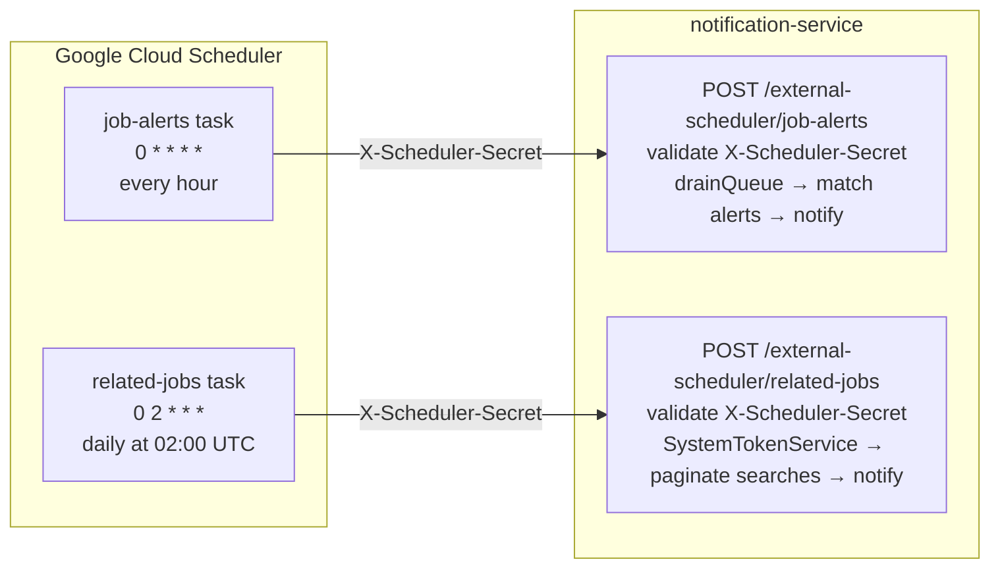
```mermaid
graph LR
    subgraph "Google Cloud Scheduler"
        C1["job-alerts task\n0 * * * *\nevery hour"]
        C2["related-jobs task\n0 2 * * *\ndaily at 02:00 UTC"]
    end

    subgraph "notification-service"
        E1["POST /external-scheduler/job-alerts\nvalidate X-Scheduler-Secret\ndrainQueue → match alerts → notify"]
        E2["POST /external-scheduler/related-jobs\nvalidate X-Scheduler-Secret\nSystemTokenService → paginate searches → notify"]
    end

    C1 -->|"X-Scheduler-Secret"| E1
    C2 -->|"X-Scheduler-Secret"| E2
```

### Job Alert Task — Logic

1. Validate `X-Scheduler-Secret` header.
2. `drainQueue()` — pull all pending `NewJobPostingEvent` messages from RabbitMQ.
3. Load all active `JobAlert` documents from MongoDB.
4. For each `(event, alert)`: if `event.matches(alert)` (partial, case-insensitive on position/town/city/workingPreference) and no duplicate `(userId, jobId)` → persist `JOB_ALERT` notification.

### Related Job Task — Logic

1. Validate `X-Scheduler-Secret` header.
2. Acquire admin JWT via `SystemTokenService` (Redis-cached, Supabase password grant).
3. Paginate `GET /searches/all?days=7&page=N&size=50` until `last == true`.
4. Group by `userId`. For each search with position/location criteria: paginate `GET /jobs`, create `RELATED_JOB` notifications for unseen jobs.

**Security:** `ExternalSchedulerValidator.validateSecret()` compares the header against `SCHEDULER_SECRET` env var, returning `403` on mismatch.

---

## 13. Deployment

All services are Docker containers deployed individually to **Google Cloud Run**.

### Spring Boot services

```dockerfile
FROM eclipse-temurin:21-jre
WORKDIR /app
COPY target/*.jar app.jar
EXPOSE 8080
ENTRYPOINT ["java", "-jar", "app.jar"]
```

### Frontend (multi-stage)

```dockerfile
FROM node:22-alpine AS build
WORKDIR /app
COPY package*.json ./
RUN npm ci
COPY . .
RUN npm run build

FROM nginx:alpine
COPY --from=build /app/dist /usr/share/nginx/html
COPY nginx.conf /etc/nginx/conf.d/default.conf
EXPOSE 80
```

Nginx proxies `/job-search/**`, `/notification/**`, `/ai/**` to the Gateway Cloud Run URL and serves the React static build for all other paths.

### Cloud Run Environment Variables

**job-search:**

| Variable | Description |
|---|---|
| `DB_URL` | PostgreSQL JDBC URL (Cloud SQL) |
| `DB_USERNAME` / `DB_PASSWORD` | Database credentials |
| `MONGO_URI` | MongoDB Atlas connection string |
| `REDIS_URL` | Redis connection URL |
| `RABBITMQ_URL` | RabbitMQ AMQP URL |
| `SUPABASE_JWKS_URI` | `https://<project>.supabase.co/auth/v1/.well-known/jwks.json` |

**job-search-notification:**

| Variable | Description |
|---|---|
| `MONGO_URI` | MongoDB Atlas connection string |
| `REDIS_URL` | Redis connection URL (job detail cache + system token cache) |
| `RABBITMQ_URL` | RabbitMQ AMQP URL |
| `SUPABASE_JWKS_URI` | JWKS endpoint for user JWT validation |
| `SUPABASE_URL` | `https://<project>.supabase.co` (for password grant) |
| `INTERNAL_ADMIN_TOKEN` | Supabase `anon` API key (sent as `apikey` header) |
| `SYSTEM_USER_EMAIL` | System service account email (`system@system.system`) |
| `SYSTEM_USER_PASSWORD` | System service account password |
| `JOB_SEARCH_API_URL` | Base URL of job-search via Gateway |
| `SCHEDULER_SECRET` | Shared secret validated by `X-Scheduler-Secret` |

**job-search-ai:**

| Variable | Description |
|---|---|
| `SUPABASE_JWKS_URI` | JWKS endpoint |
| `GEMINI_API_KEY` | Google Gemini API key |
| `GEMINI_MODEL` | Model name, e.g. `gemini-2.0-flash` |
| `JOB_SEARCH_BASE_URL` | Base URL of job-search via Gateway |

**job-search-gateway:**

| Variable | Description |
|---|---|
| `JOB_SEARCH_URI` | Internal Cloud Run URL of job-search |
| `NOTIFICATION_URI` | Internal Cloud Run URL of notification |
| `AI_URI` | Internal Cloud Run URL of AI service |

---

## 14. Design Assumptions

| # | Assumption | Rationale |
|---|---|---|
| 1 | **No real email/SMS sending.** Notifications stored in MongoDB, surfaced in-app. | Spec does not require actual delivery. SMTP/SendGrid is out of scope. |
| 2 | **Supabase Auth over AWS Cognito.** | Cognito has no free tier; its JWT is non-standard. Supabase provides free, standards-compliant OIDC with the same IAM guarantees. |
| 3 | **Google Cloud Scheduler over `@Scheduled`.** | Cloud Run scales to zero. In-process `@Scheduled` keeps a container alive 24/7. External HTTP triggers decouple schedule from container lifecycle. |
| 4 | **Drain-on-demand RabbitMQ consumer.** | A persistent AMQP push consumer prevents scale-to-zero. Synchronous pull on cron fire is a better fit for serverless. |
| 5 | **Redis cache soft-fail (warn + miss, no rethrow).** | Cache failures are transient; they must never fail a user request. DB is always the source of truth. |
| 6 | **System token cached in Redis, not env variable.** | A static long-lived token is a security anti-pattern. Short-lived JWTs cached in Redis with a distributed lock reduce blast radius. |
| 7 | **Split HTTP clients (admin vs. public).** | Sending auth tokens to unauthenticated endpoints is unnecessary credential leakage. Only the admin client (calling `/searches/all`) uses the Bearer interceptor. |
| 8 | **`userId` in `APPLICATIONS` is raw Supabase UUID string.** | No separate users table needed — identity is fully managed by Supabase. |
| 9 | **Related jobs matched by first word of title + same city.** | Simple keyword match provides useful recommendations without a full-text search engine. Upgradable to Elasticsearch. |
| 10 | **AI real-time streaming NOT implemented.** | The spec explicitly states: *"For AI Agent, real time messaging IS NOT required."* |

---

## 15. Issues Encountered & Solutions

| Issue | Root Cause | Solution |
|---|---|---|
| **Redis `missing type id property '@class'`** | `RedisTemplate<String, Object>` with `activateDefaultTyping` expects `@class` in every cached JSON. Test/seed data lacked it. | Switched to `RedisTemplate<String, JobDetailResponseDto>` with `Jackson2JsonRedisSerializer<JobDetailResponseDto>`. Also made `find()` and `save()` soft-fail so stale keys never break requests. |
| **CORS errors from Swagger UI** | `.cors(AbstractHttpConfigurer::disable)` stripped all CORS headers. | Replaced with `.cors(c -> c.configurationSource(corsConfigurationSource()))` and a `CorsConfigurationSource` bean allowing all origins/methods/headers. |
| **RabbitMQ 500 — `failed to resolve class name`** | AMQP message header embeds publisher's FQCN; consumer's local class is at a different package. | `DefaultJackson2JavaTypeMapper.setIdClassMapping()` in `RabbitConfig` maps publisher FQCN → local class. |
| **Pagination with `Integer.MAX_VALUE`** | Initial cron fetched all data in a single page of size `MAX_VALUE`, causing memory pressure. | `fetchAllPages()` / `fetchAllSearchPages()` helpers loop with `size=50`, stopping when `PageResponse.last() == true`. |
| **Static admin token as env variable** | Long-lived credential with no expiry stored in an environment variable. | `SystemTokenService` acquires short-lived Supabase JWT (TTL ≈ 3500 s), cached in Redis with distributed lock preventing thundering herd. |
| **Cloud Run cold-start latency** | JVM startup + Spring context initialization on first request. | Gateway configured with min-instances=1. Backend services warm within 2–3 s. |
| **RabbitMQ connection dropped on scale-down** | Cloud Run terminates the container; AMQP keep-alives fail before reconnect. | Drain-on-demand: connection opened and closed per cron invocation, no persistent listener. |
| **Duplicate notifications on parallel cron** | Two Cloud Run instances could fire on the same cron tick. | `existsByUserIdAndJobId()` dedup check before every notification insert. |

---

## 16. Local Development

### Prerequisites

- Docker Desktop
- Java 21
- Node.js 22
- Maven 3.9+

### Start infrastructure

```bash
# from job-search/
docker-compose up -d
# Starts: PostgreSQL, MongoDB, Redis, RabbitMQ
```

### Run services

```bash
# Terminal 1 — Core service
cd job-search && mvn spring-boot:run

# Terminal 2 — Notification service
cd job-search-notification && mvn spring-boot:run

# Terminal 3 — AI service
cd job-search-ai && mvn spring-boot:run

# Terminal 4 — Gateway
cd job-search-gateway && mvn spring-boot:run

# Terminal 5 — Frontend
cd job-search-frontend && npm install && npm run dev
```

Open `http://localhost:5173` — Vite dev server proxies API calls to the gateway at `http://localhost:9000`.

### Environment Variables

Copy `.env.example` to `.env` in each service directory and fill in the required values. See [§13 — Deployment](#13-deployment) for the full variable list.

---

*SE 4458 Software Architecture & Design of Modern Large Scale Systems — Spring 2026*
